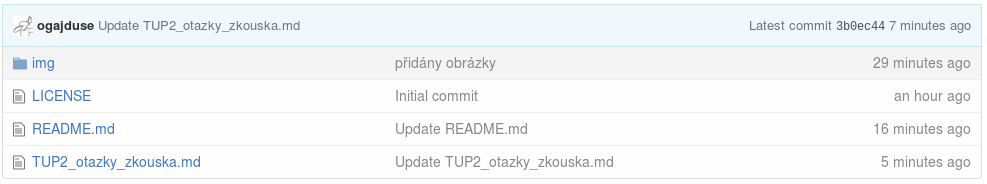
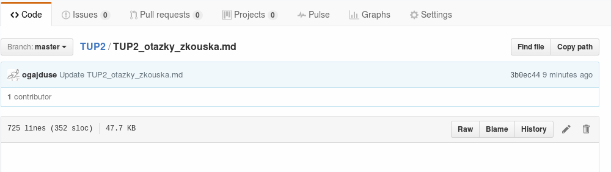
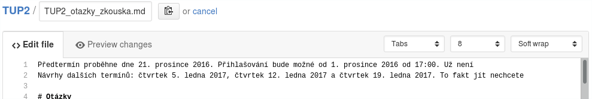
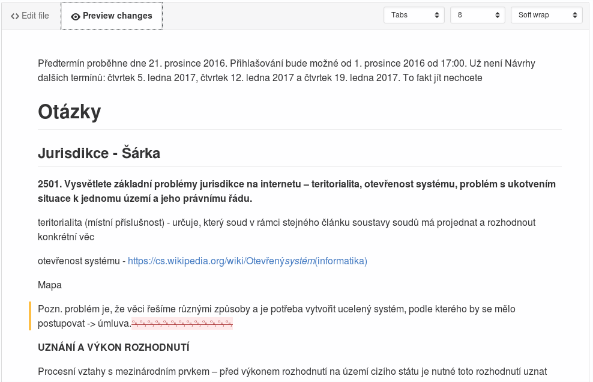
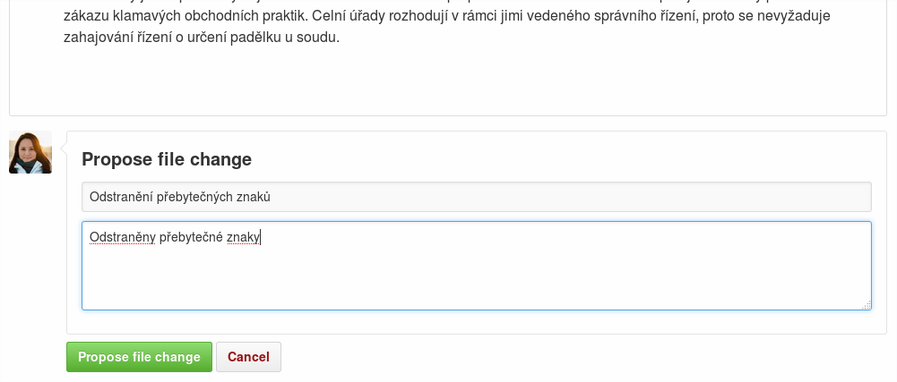
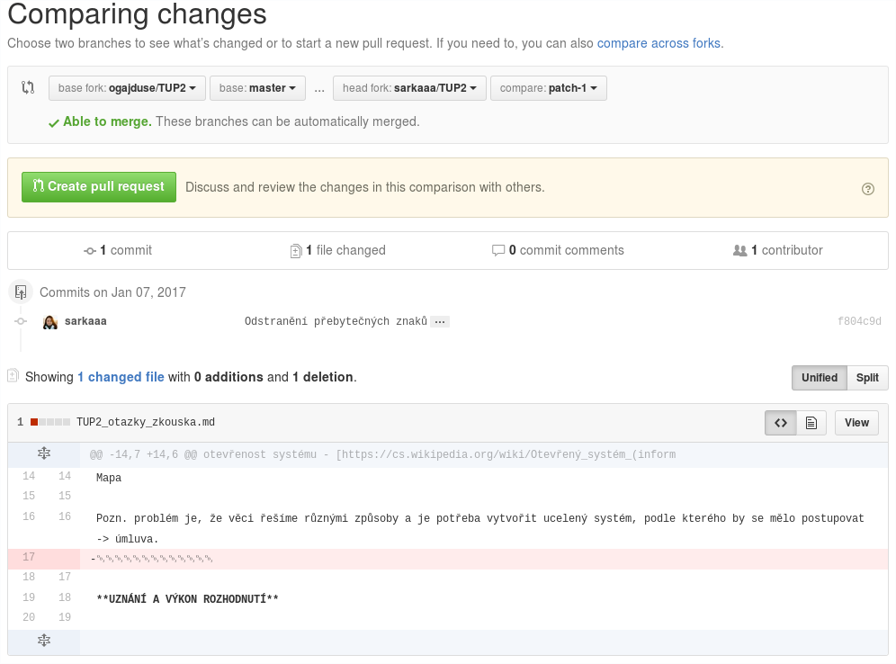
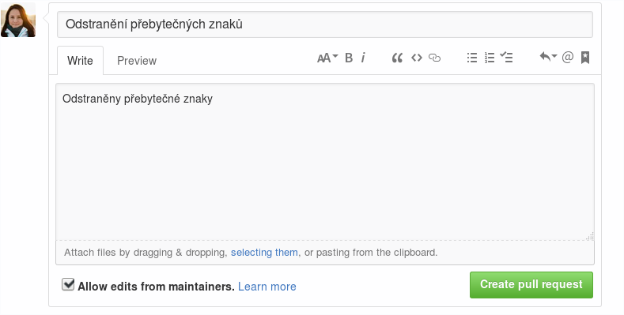
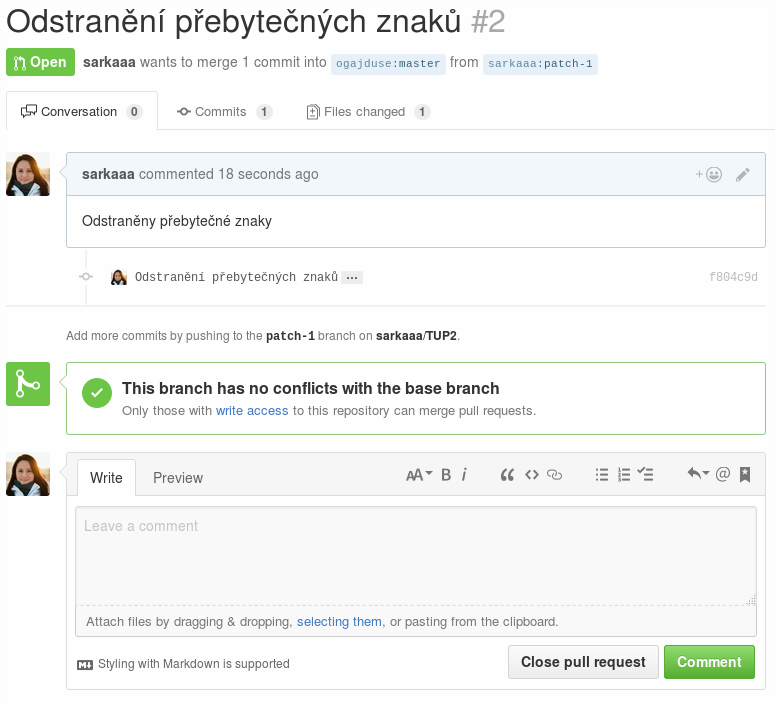
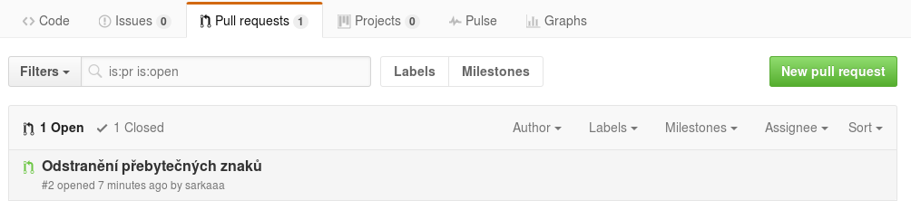

# TUP2
Učební materiály do předmětu TUP2 vyučovaného na FEKT VUT Brno.

Dokument je psán v jazyce [Markdown](https://cs.wikipedia.org/wiki/Markdown). Pokud byste si s Markdownem nevěděli rady, [zde](https://guides.github.com/features/mastering-markdown/) je menší příručka a [tady](https://github.com/adam-p/markdown-here/wiki/Markdown-Cheatsheet) menší tahák.

Přidání nových poznatků, odkazů, informací, či jakéhokoli jiného obsahu, který v dokumentu chybí, lze realizovat prostřednictvím pull requestu. Nad jednotlivými řádky lze diskutovat, můžete také otevřít Issue.

[citace/komentáře, které nebudou zobrazeny lze vkládat následujícím způsobem]: # (Zde je komentář)

## Zpracovali:
* [Jan Štangler](https://github.com/jstangle)
* Roman Ligocki
* [Šárka Chwastková](https://github.com/sarkaaa)
* [Maroš Matisko](https://github.com/marosmatisko)
* [Ondřej Gajdušek](https://github.com/ogajduse)

## Jak přidat/upravit obsah dokumentu, jak vytvořit pull request
Začněte tím, že vyberete dokument, který chcete upravovat a otevřete jej.
> 

Po otevření klikněte na malou ikonu s tužkou (vedle tlačítka *History*)
> 

Otevře se vám zobrazení pro úpravy, zde můžete upravit dokument podle vaší libosti. Provedené změny lze zobrazit v záložce v *Preview changes*.
> 

Pro účel této ukázky odebereme z dokumentu přebytečné znaky. Na obrázku níže lze vidět zvýrazněnou změnu.
> 

Jakmile jste se změnami spokojeni, vyplňte ve spodní části stránky pod dokumentem stručný popis, který vystihuje provedené úpravy a komentář k nim. Následně potvrďte.
> 

V předchozím kroku jste vytvořili svou vlastní verzi dokumentu a nyní je z ní třeba vytvořit pull request, aby tato verze dokumentu mohla nahradit verzi v tomto repozitáři. Stiskněte tlačítko *Create pull request*
> 

V dalším kroku můžete rozšířit PR o další komentář, lze jej psát v Markdownu. Potvrďte vytvoření PR.
> 

Úspěšně jste vytvořili pull request, nyní mohou před potvrzením vašich změn ostatní diskutovat.
> 

Vámi vytvořený PR je k vidění po kliknutí na záložku *Pull requests*.
> 
