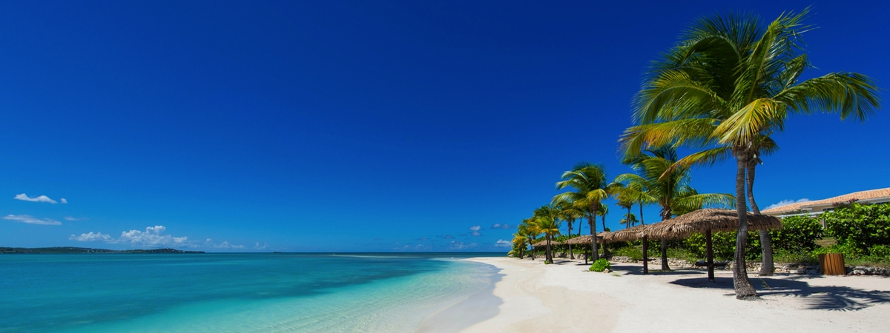
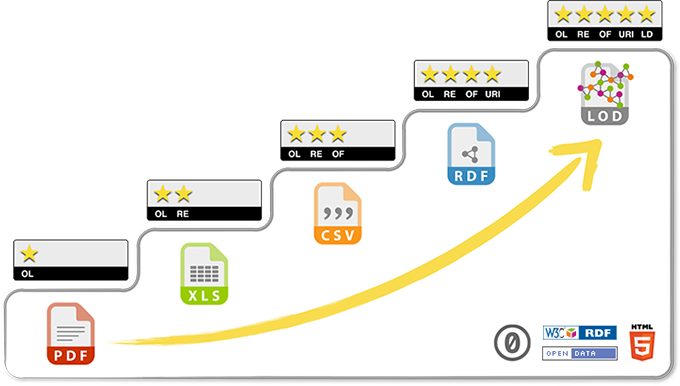
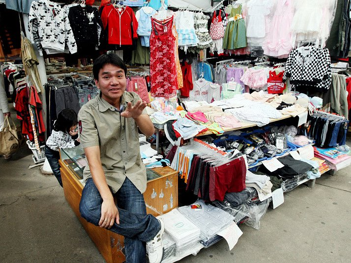

Předtermín proběhne dne 21. prosince 2016. Přihlašování bude možné od 1. prosince 2016 od 17:00. Už není
Návrhy dalších termínů: čtvrtek 5. ledna 2017, čtvrtek 12. ledna 2017 a čtvrtek 19. ledna 2017. To fakt jít nechcete

# Otázky

## Jurisdikce - Šárka

### 1. Vysvětlete základní problémy jurisdikce na internetu – teritorialita, otevřenost systému, problém s ukotvením situace k jednomu území a jeho právnímu řádu.

teritorialita (místní příslušnost) -  určuje, který soud v rámci stejného článku soustavy soudů má projednat a rozhodnout konkrétní věc

otevřenost systému - [Wiki](https://cs.wikipedia.org/wiki/Otevřený_systém_(informatika))

Mapa

Pozn.
>problém je, že věci řešíme různými způsoby a je potřeba vytvořit ucelený systém, podle kterého by se mělo postupovat -> úmluva.

**UZNÁNÍ A VÝKON ROZHODNUTÍ**

Procesní vztahy s mezinárodním prvkem – před výkonem rozhodnutí na území cizího státu je nutné toto rozhodnutí uznat

 Uznání – přiznání rozhodnutí má stejné právní účinky, které má ve státě vydání

Rozsudek cizího státu může mít na území ČR účinek jen tehdy, pokud tak stanoví zákon, nebo vyhlášená mezinárodní smlouva, kterou je ČR vázána (dvoustranné, mnohostranné)

**JURISDIKCE NA INTERNETU**

a) Trestní jurisdikce

b) Správní jurisdikce

c) Finanční jurisdikce

**a) TRESTNÍ JURISDIKCE**

- Ochrana základních hodnot a zájmů států a společnosti

- Princip neoddělitelnosti jurisdikce a rozhodného práva – trestní soud, je-li příslušný k rozhodnutí ve věci, rozhoduje vždy podle práva svého státu

**Prameny**

- Zákon č. 40/2009 Sb. Trestní zákoník

- Zákon č. 141/1961 Sb., o trestním řízení soudním (trestní řád)

- Dvoustranné smlouvy o právní pomoci uzavřené mezi ČR a druhými státy – právní pomoc, pravomoc a příslušnost soudů, uznání rozhodnutí

**Lze stíhat trestné činy, které**

-  Byly přímo spáchány na území příslušného státu

-  Jejichž následky se na území tohoto státu projevily

- Které mají jen nepřímou souvislost s tímto územím

-  Lze stíhat TČ, jejichž pachatel se nachází mimo zemí ČR, příklady

### 2. Uveďte základní přínosy a problémy Úmluvy o počítačové kriminalitě z pohledu trestání kyberkriminality na internetu.

**PŘÍNOSY**

* sjednocení vybraných skutkových podstat TČ v oblasti počítačové kriminality

* možnost postihu PO v případě dopouštění se počítačové kyberkriminality

* jednotné potírání kyberkriminality v mezinárodním měřítku (mezinárodní spolupráce)

* existence jediného orgánu/institutu v rámci každého státu pro komunikaci s ostatními

**PROBLÉMY**

* nejednotně upravená otázka odpovědnosti poskytovatelů informačních služeb

* účinnost úmluvy nemá výrazný ,,posun" v řešení protizákonného jednání oproti českého TZ

* Úmluva má přednost před českým TZ i v případě, že některá ustanovení Úmluvy a TZ nejsou zcela v souladu

[https://www.patria.cz/pravo/2694193/pocitacova-kriminalita-mezinarodni-umluva-je-konecne-zavazna-i-pro-cesko.html](https://www.patria.cz/pravo/2694193/pocitacova-kriminalita-mezinarodni-umluva-je-konecne-zavazna-i-pro-cesko.html)

### 3. Uveďte, jaké základní otázky spadají do finančního práva a finanční jurisdikce.

**Finanční jurisdikce a finanční právo**

Pravomoc/příslušnost finančních orgánů, soudů

**1. Daňová jurisdikce**

* Prodej, nákup, export, import zboží, služeb

* Zda dané zboží, služba bude zdaněna, ve kterém státě a v jaké výši

*Druhy daní*

* **Přímé daně – stanovovány v závislosti na výši důchodu nebo majetku**

    * Daň z příjmu FO

    * Daň z příjmu PO

    * Daň z majetku, dědická, darovací…

* **Nepřímé daně – uvalené na statky nebo služby**

    * DPH

    * Spotřební daň

* Často dochází k souběhu jurisdikcí více států = dvojí zdanění

* Smlouvy o zamezení dvojího zdanění

* Metoda započtení (započte se daň zaplacená v jiném státě namísto části daně, která má být zaplacena v tomto státě)

* Metoda vynětí (započte se základ daně vyměřený nebo podaný v daňovém přiznání v jiném státě místo části základu daně, který má být vyměřen nebo podán v daňovém přiznání v tomto státě)

* Metoda zahrnutí daně zaplacené v zahraničí do nákladů

* **Mezinárodní daňové organizace**

    *  Evropská organizace daňových správ (IOTA)

    * Americká organizace daňových správ (CIAT)

    * Organizace pro ekonomickou spolupráci a rozvoj (OECD)

    * Asociace daňových správ Spojeného království (CATA)

    * Centrum frankofonních daňových správ (CREDAF)

**2. Celní jurisdikce**

U zboží

**Dělení cel**

* dovozní clo – na dovážené zboží, dnes v rámci obchodu se státy mimo EU

* vývozní clo – na vyvážené zboží, v EU se nepoužívá

* průvozní clo - na zboží v tranzitním režimu - odstraněno v roce 1921 Barcelonskou úmluvou

**Evropská unie**

V obchodu mezi členskými státy EU jsou cla zakázána úplně

1968 – společná celní politika, Společný celní sazebník

1993 – jednotný vnitřní trh, 1994 Celní zákoník

EU – jednotné celní území, odstranění všech cel mezi členskými státy

Společná celní politika vůči nečlenským státům

Celní unie s jinými státy, mnohostranné a dvoustranné mezinárodní smlouvy

**3. Dohledová a dozorová jurisdikce**

* Mezinárodní spolupráce

* Dohled nad finančním trhem, platebním stykem, bankovnictví – ČNB

* MF – internetové hry, loterie, sázky

### 4. Analyzujte základní body případu Antigua a Barbuda vs. USA (online gambling).

- koncepce efektivní přítomnosti pachatele na území státu

- pachatel se na území státu v době páchání trestného činu nenacházel, ani zde nedošlo přímo k jeho spáchání, ale projevil se zde efekt/účinek jednání

[http://poker.nova.cz/clanek/novinky/antigua-chce-zalovat-usa-kvuli-zakazu-on-line-pokeru.html](http://poker.nova.cz/clanek/novinky/antigua-chce-zalovat-usa-kvuli-zakazu-on-line-pokeru.html)

[http://www.pokerarena.cz/rubriky/aktuality/poker-v-usa-zakrok-fbi-proti-pokerstars-a-full-tilt-pokeru-zrejme-cechy-neovlivni_2729.html](http://www.pokerarena.cz/rubriky/aktuality/poker-v-usa-zakrok-fbi-proti-pokerstars-a-full-tilt-pokeru-zrejme-cechy-neovlivni_2729.html)

[http://www.cnews.cz/clanky/karibsky-statecek-se-msti-usa-zlegalizuje-warez](http://www.cnews.cz/clanky/karibsky-statecek-se-msti-usa-zlegalizuje-warez)

[https://is.muni.cz/th/170034/pravf_b/Reseni_sporu_v_ramci_WTO.pdf](https://is.muni.cz/th/170034/pravf_b/Reseni_sporu_v_ramci_WTO.pdf)

## Otevřená data - Šárka

### 1. Pojem *otevřená data*

> **Otevřená data jsou informace a čísla bezplatně a volně dostupná na internetu ve strukturované a strojově čitelné podobě a jsou zpřístupněna způsobem, který jejich využití neklade zbytečné technické či jiné překážky.**

Formát a struktura otevřených dat tedy umožňuje jejich hromadné počítačové zpracování, k němuž jejich vydavatel poskytl právní svolení. Díky tomu mohou být dál volně zpracovávány, a to i v rámci softwarových aplikací.

Jedná se například o jízdní řády, příjmy států, seznam poskytovatelů sociálních služeb, kalendář ministra nebo měření čistoty ovzduší. Pocházejí z univerzit, nevládních organizací, soukromých firem nebo veřejné správy.

V České republice můžeme díky zákonu o svobodném přístupu k informacím zatím získávat jen část z údajů, které úřady shromážďují. Pokud si o to zažádají a úřad jim vyhoví. Otevřená data by měl naopak zveřejnit sám vydavatel na internetu tak, aby je všichni mohli snadno najít a stáhnout. Otevřená data lze chápat i v širším smyslu - kromě informací veřejné správy lze využít i data komerčních subjektů.

[http://www.jaknainternet.cz/page/1701/otevrena-data](http://www.jaknainternet.cz/page/1701/otevrena-data/)

[*pro zajímavost* Otevřená Data v příloze týdeníku Ekonom](http://www.otevrenadata.cz/res/data/003/003663.pdf)

### 2. Obecná právní úprava otevřených dat
Zákon č. [106/1999 Sb](https://www.zakonyprolidi.cz/cs/1999-106)., o svobodném přístupu k informacím
* „OD novela" z. č. [298/2016 Sb.](https://www.zakonyprolidi.cz/cs/2016-298)
  * Účinnost od 1. 1. 2017
* Navazuje na PSI novelu – z. č. [222/2015 Sb.](https://www.zakonyprolidi.cz/cs/2015-222)
* OD = Kvalifikovaný způsob poskytování informací zveřejněním

**§ 3 odst. 11:** *„Otevřenými daty se pro účely tohoto zákona rozumí informace zveřejňované způsobem umožňujícím dálkový přístup v otevřeném a strojově čitelném formátu, jejichž způsob ani účel následného využití není omezen a které jsou evidovány v národním katalogu otevřených dat."*

Právní úprava OD v ČR – nová povinnost publikovat
* **§ 4b odst. 2:** *„Povinné subjekty zveřejňují informace obsažené v jimi vedených nebo spravovaných registrech, evidencích, seznamech nebo rejstřících, které jsou na základě zákona každému přístupné a které lze využít při podnikání nebo jiné výdělečné činnosti, ke studijním nebo vědeckým účelům anebo při veřejné kontrole povinných subjektů, jako otevřená data. Povinné subjekty zaevidují tyto informace v národním katalogu otevřených dat. Seznam informací podle věty první stanoví prováděcí právní předpis."*
  * Zmocnění Vlády vydat nařízení, kterým určí informace povinně poskytované jako OD („povinné datové sady“) = nastartování ekosystému OD.

### 3. Technická infrastruktura otevřených dat v ČR (katalogy a způsob registrace)

* **Národní katalog otevřených dat**
  * Informační systém veřejné správy
  * Spravuje jej Ministerstvo vnitra (dle § 4c z. č. 106/1999 Sb., o svobodném přístupu k informacím)
  * Centrální uzel pro Otevřená data v ČR
  * Obsahuje Metadata ke všem OD v ČR
  * Může obsahovat rovněž přímo datové sady
  * Malá kapacita
  * Předpoklad pro navázání na Evropský katalog OD

[http://5stardata.info/cs/](http://5stardata.info/cs/)

### 4. Právní překážky při otevírání dat
* anonymizace dat (ochrana osobních údajů)
* licence, autorská práva
* (citlivá, tajná a nebo potenciálně zneužitelná data?)
* zvláštní právo pořizovatele databáze

**Legislativa ČR:**
Otevřená data v ČR vychází ze Směrnice Evropského parlamentu a Rady 2003/98/ES ze dne 17. listopadu 2003 o opakovaném použití informací veřejného sektoru ve znění Směrnice Evropského parlamentu a Rady 2013/37/EU ze dne 26. června 2013. Evropská směrnice je do české legislativy implementována zákonem 106/1999 Sb. o svobodném přístupu k informacím. Podrobnější rámec pro otevřená data má od 1.1.2017 poskytnout novela zákona č. 106/1999 Sb., o svobodném přístupu k informacím[[10]](https://cs.wikipedia.org/wiki/Otev%C5%99en%C3%A1_data#cite_note-10).

[https://www.zakonyprolidi.cz/cs/1999-106](https://www.zakonyprolidi.cz/cs/1999-106)

## Osobní údaje - Maroš
[https://is.muni.cz/do/1492/el/sitmu/law/html/souhlas.html](https://is.muni.cz/do/1492/el/sitmu/law/html/souhlas.html)** 2.8 - 2.11**

### 1. Ochrana soukromí a ochrana osobních údajů – teorie a praxe
* Ochrana súkromia
  * súkromnoprávna rovina
  * zaručená:
    * čl. 7 Listiny základných práv a slobôd
    * čl. 8 Európskej dohody (úmluvy) o ľudských práva a základných slobodách
    * čl. 7 Charty základných ľudských práv Európskej únie
  * pri porušení je potrebné podať súkromnoprávnu žalobu na súd
    * náklady na súdne konanie, poškodený je účastníkom konania
  * Reaktívny účinok – následne až po vykonaní skutku

* Ochrana osobných údajov
  * Osobný údaj
    * Informácia, pomocou ktorej je možné jednoznačne identifikovať subjekt, hlavne na základne čísla, kódu, kombinácii viacerých znakov.
    * Objektívne poňatie: Ak je možné pomocou tohto údaju spárovať človeka aj ilegálnymi prostriedkami, je to osobný údaj. (Judikatúra v Nemecku a novšie rozhodnutia Súdneho dvora Európskej únie (SDEU)
    * Subjektívne poňatie: Ak je možné pomocou tohto údaju spárovať človeka bez neprimeraných nákladov (legálnymi prostriedkami), potom je to osobný údaj. V opačnom prípade to osobný údaj nie je. (Judikatúra ČR, staršie rozhodnutia SDEU)
  * Verejnoprávna rovina
  * Zaručená:
    * Čl. 8 Charty základných ľudských práv Európskej únie
    * Smernica o ochrane fyzických osôb pri spracovaní osobných údajov a voľnom pohybe týchto údajov 95/46/EHS do 28.5.2018
    * Nariadenie o ochrane fyzických osôb pri spracúvaní osobných údajov a o voľnom pohybe takýchto údajov od 28.5.2018 – GDPR (General data protection regulation)
    * Zákon o ochrane osobných údajov a o zmene niektorých zákonov č. 101/2000 Sb.
  * Pri podozrení na porušenie ochrany možné podať podnet na úrad na ochranu osobných údajov, ten následne zaháji správne konanie a oznamovateľ sa len dozvie výsledok, nie je účastníkom konania

### 2. Základní principy zpracování osobních údajů
* Spracovanie – zákon 101/2001 Sb. §4e
  * Operácia alebo sústava operácii, ktoré správca alebo poverený spracovateľ systematicky vykonávajú, a to hlavne automatizovane alebo inými prostriedkami. Sú to prevažne:
    * Zhromažďovanie, ukladanie na nosič informácii, uchovávanie
    * Sprístupňovanie, šírenie, zverejňovanie,
    * vyhľadávanie, úprava, pozmeňovanie, triedenie, kombinovanie
    * blokovanie, likvidácia
  * Zhromažďovanie OÚ:
    * Postup alebo súbor postupov na získanie údajov, za účelom ich ďalšieho uloženia na nosič informácii pre ich okamžité alebo neskoršie spracovanie
  * Uchovávanie OÚ:
    * Udržiavanie údajov v podobe, ktorá umožňuje ich ďalšie spracovanie.
  * Blokovanie OÚ:
    * Operácia alebo sústava operácii, ktorými sa na stanovenú dobu obmedzí spôsob alebo prostriedky spracovania OÚ s výnimkou nevyhnutných zásahov
* Nutné náležitosti pre spracovanie OÚ:
  * Informovaný súhlas o spracovaní osobných údajov, ktorý mimo iné musí obsahovať:
    * Právny titul (kdo a v jakém rozsahu může spracovávat údaje)
    * Legálny účel
    * Prostriedky a spôsob spracovania – úkony spracovania
  * Informovaný súhlas – slobodný a vedomý prejav vôle subjektu údajov, ktorého obsahom je súhlas objektu údajov so spracovaním jeho osobných údajov
* Zabezpečenie OÚ:
  * Správca a spracovateľ sú povinní prijať bezpečnostné opatrenia, aby nemohlo nastať:
    * Neoprávnený alebo náhodný prístup k OÚ, ich zneužitie, zmena, neoprávnený prenos, zničenie či strata
    * Prístup neoprávnenej osoby
    * Počas aj po skončení spracovania
* Technické opatrenia:
  * Organizačné poistky
  * Autentizácia a autorizácia prístupu k údajom
  * Zmluvná úprava (Zmluva o mlčanlivosti - NDA – non-disclosure agreement)

### 3. Osobní údaje a jejich zpracování – vymezení a zúčastněné osoby

* Subjekt údajov – Zákon 101/2000Sb §4d
  * Fyzická osoba na ktorú sa vzťahujú osobné údaje
  * Má právo požiadať správcu údajov o informáciu o spracovaní svojich osobných údajov:
    * Účel spracovania, kategória OÚ, povaha automatizovaného spracovania, príjemcovia výsledkov spracovania

* Správca údajov – Zákon č. 101/2000 Sb. §5 ods. 1
  * Subjekt, ktorý zodpovedá za spracovanie údajov, môže poveriť spracovateľa
    * Povinný:
      * Stanoviť účel, prostriedky a spôsob spracovania údajov
      * Spracovať len presné osobné údaje, získané na základe zákona a súhlasu subjektu údajov, len v súlade s účelom, k čomu boli získané
      * Zhromažďovať len osobné údaje nevyhnutné pre účel spracovania, nezhromažďovať osobné údaje pod zámienkou iného účelu
      * Nezdružovať osobné údaje, ktoré boli získané k rozdielnym účelom
    * Spracovanie OÚ bez súhlasu subjektu údajov v prípade:
      * Spracovanie nevyhnutné pre splnenie právnej povinnosti správcu (napr. zákon 111/1198 Sb. O Vysokých školách)
      * Nevyhnutné pre plnenie zmluvy, ak je jednou zo strán subjekt údajov
      *  Ochrany životne dôležitých záujmov subjektu údajov, súhlas je potrebné získať bez zbytočného odkladu, v opačnom prípade musí správca ukončiť spracovanie a zlikvidovať údaje
      * Oprávnene zverejnené osobné údaje v súlade so zvláštnym predpisom (zákon č. 81/1966 Sb. O periodickej tlači a ostatných hromadných informačných prostriedkoch)
      * Výlučne pre účely archívnictva podľa zvláštneho zákona (499/2004 Sb.)

* Spracovateľ – subjekt, ktorý na základe zvláštneho zákona alebo poverenia správcu spracováva osobné údaje

### 4. Zpracování citlivých osobních údajů – *Zákon 101/2000 Sb. §9*

* Citlivé údaje
  * Údaj vypovedajúci o národnostnom, rasovom alebo etnickom pôvodne, politických postojoch, členstvách v odborových organizáciach, náboženské alebo filozofické presvedčenie, odsúdenie za trestný čin, zdravotný stav a sexuálny život subjektu údajov a genetické údaje subjektu údajov (biometrika)

* Možné spracovanie na základe:
  * Výslovný súhlas subjektu údajov, správca je povinný dokázať súhlas počas doby spracovania s informáciami o účele spracovania, spracovateľovi a doby spracovania, je povinný poučiť subjekt údajov o jeho právach podľa §12 a §21
  * Nevyhnutný záujem na zachovaní života alebo zdravia subjektu údajov alebo odvrátenie bezprostredného závažného nebezpečenstva hroziaceho majetku subjektu údajov, pokiaľ nie je možné získať jeho súhlas z dôvodu fyzickej, psychickej alebo právnej nespôsobilosti, v prípade skončenia platnosti uvedených dôvodov je správca povinný tieto údaje zlikvidovať okrem prípadu, kedy subjekt údajov poskytne súhlas k ich ďalšiemu spracovaniu
  * Poskytovanie zdravotných služieb, ochrany verejného zdravia, zdravotného poistenia a výkon štátnej správy v oblasti zdravotníctva
  * Spracovanie nevyhnutné pre dodržanie povinnosti a práv správcu zodpovedného za spracovanie údajov v oblasti pracovného práva a zamestnanosti podľa zvláštneho zákona (zákon č. 65/1965, zákonník práce)
  * Zverejnenie údajov subjektom údajov
  * Zaistenie a uplatnenie právnych nárokov
  * Pre účely archívnictva podľa zvláštneho zákona
  * Na základne zvláštnych zákonov pri predchádzaní, vyhľadávaní, odhaľovaní trestnej činnosti, stíhaní trestných činov a pátraní po osobách

* Subjekt nesmie utrpieť ujmu na svojich právach spracovaním jeho citlivých OÚ, hlavne na zachovania ľudskej dôstojnosti a na nedotknuteľnosť súkromného a osobného života.
* Poučenie subjektu údajov:
  * Rozsah a účel spracovania OÚ, komu môžu byť OÚ sprístupnené
  * Právo na prístup a úpravu OÚ
  * Dobrovoľné/povinné poskytnutie OÚ, následky povinného neposkytnutia OÚ
* Poučenie nie je správca povinný poskytnúť v prípade, ak OÚ nezískal od subjektu údajov, pokiaľ:
  * Spracováva OÚ výlučne pre účely výkonu štátnej štatistickej služby, vedeckej alebo archívnej činnosti a poskytnutie takých informácii by vyžadovali neúmerné úsilie alebo neprimerane vysoké náklady, alebo pokiaľ je ukladanie na nosič informácii alebo sprístupnenie je výslovne stanovené zvláštnym zákonom
  * Spracovanie OÚ správcovi ukladá zvláštny zákon
  * Spracováva výlučne oprávnene zverejnené OÚ alebo so súhlasom subjektu údajov
* Správca je povinný bezodkladne povinný informovať subjekt údajov o spracovaní jeho osobných údajov, túto povinnosť môže za správcu plniť spracovateľ OÚ

### 5. Práva subjektu údajů ve vztahu ke správci a zpracovateli – *Zákon 101/2000 Sb. §12, §21*

* Právo na informácie o spracovaní svojich osobných údajov správcom OÚ, obsahuje:
  * Účel spracovania OÚ
  * Osobné údaje, príp. kategória osobných údajov, vrátane všetkých dostupných informácii o ich zdroji
  * Povahe automatizovaného spracovania v súvislosti s využitím pre rozhodovanie
  * Príjemcovia, kategórie príjemcov
    * Môže za správcu splniť spracovateľ OÚ
* Právo na primeranú náhradu za poskytnuté informácie neprevyšujúce náklady na nevyhnutné poskytnutie informácie
* Právo požiadať správcu o vysvetlenie v prípade podozrenia na porušenie zákona pri spracovaní zákona, právo požadovať odstránenie chybného stavu – doplnenie, opravenie, likvidácia OÚ

## Elektronické důkazy - Honza
Podle [§89 TŘ (2)](https://www.zakonyprolidi.cz/cs/1961-141#f2679478) je důkazem vše, co může přispět k objasnění věci. Důkazní prostředek tak lze vymezit jako *„zdroj, z něhož orgán činný v trestním řízení důkazy čerpá (výpovědi osob, věci)"*

Elektronický důkaz =  zdroj relevantní informace v elektronické podobě (data). Pojem elektronické důkazní prostředky není v současném platném právu České republiky nikde definován a vlastně ani zmíněn.

Nejobecněji lze v tomto smyslu elektronické důkazní prostředky definovat jako takové „důkazní prostředky, k jejichž převodu do podoby srozumitelné pro člověka je třeba použít nějaké elektronické zařízení".

[http://is.muni.cz/repo/1340183/Polcak_Elektronicke_dukazy.pdf](http://is.muni.cz/repo/1340183/Polcak_Elektronicke_dukazy.pdf)

### 1. Jaké nároky jsou kladeny na zákonnost elektronického důkazu?

Podle [§ 2 zákona č. 480/2004 Sb.](https://www.zakonyprolidi.cz/cs/2004-480#f2623940), o některých službách informační společnosti, že tyto důkazní prostředky získávají důkazy pomocí sítě elektronických komunikací, elektronických komunikačních zařízení, koncových telekomunikačních zařízení a elektronické pošty. Jedná se o elektronické důkazy jako elektronickou textovou poštu, hlasovou, zvukovou nebo obrazovou zprávu, obsah webových stránek a počítačová data.

**Zákon č. 141/1961 Sb., trestní řád**

**Procesní nástroje elektronických důkazů**

[§78 Povinnost k vydání věci](http://zakony.centrum.cz/trestni-rad/cast-1-hlava-4-oddil-0-paragraf-78)

[§88 Odposlech](http://zakony.centrum.cz/trestni-rad/cast-1-hlava-4-oddil-0-paragraf-88)

[§88a Záznam telekomunikačního provozu](http://zakony.centrum.cz/trestni-rad/cast-1-hlava-4-oddil-0-paragraf-88a)

[§158d Sledování osob a věcí](http://zakony.centrum.cz/trestni-rad/cast-2-hlava-9-paragraf-158d)

**§78 TŘ (1)** Kdo má u sebe *hmotnou věc důležitou pro trestní řízení*, je povinen ji na vyzvání předložit soudu, státnímu zástupci nebo policejnímu orgánu; je-li ji nutno pro účely trestního řízení zajistit, je povinen věc na vyzvání těmto orgánům vydat. Při vyzvání je třeba ho upozornit na to, že nevyhoví-li výzvě, může mu být věc odňata, jakož i na jiné následky nevyhovění (§ 66).
**(2) **Povinnost podle odstavce 1 se nevztahuje na listinu, jejíž obsah se týká okolnosti, o které platí zákaz výslechu, ledaže došlo k zproštění povinnosti zachovat věc v tajnosti nebo k zproštění povinnosti mlčenlivosti (§ 99).
**(3)** Vyzvat k vydání věci je oprávněn předseda senátu, v přípravném řízení státní zástupce nebo policejní orgán.

**§88 TŘ (6) **Má-li být záznam telekomunikačního provozu užit jako důkaz, je třeba k němu připojit protokol s uvedením údajů o místě, času, způsobu a obsahu provedeného záznamu, jakož i o orgánu, který záznam pořídil. …
**§88a TŘ** **(1)** Je-li třeba pro účely trestního řízení vedeného pro úmyslný trestný čin, na který zákon stanoví trest odnětí svobody s horní hranicí trestní sazby nejméně tři roky, pro trestný čin porušení tajemství dopravovaných zpráv (§ 182 trestního zákoníku), pro trestný čin podvodu (§ 209 trestního zákoníku), pro trestný čin neoprávněného přístupu k počítačovému systému a nosiči informací (§ 230 trestního zákoníku), pro trestný čin opatření a přechovávání přístupového zařízení a hesla k počítačovému systému a jiných takových dat (§ 231 trestního zákoníku), pro trestný čin nebezpečného vyhrožování (§ 353 trestního zákoníku), pro trestný čin nebezpečného pronásledování (§ 354 trestního zákoníku), pro trestný čin šíření poplašné zprávy (§ 357 trestního zákoníku), pro trestný čin podněcování k trestnému činu (§ 364 trestního zákoníku), pro trestný čin schvalování trestného činu (§ 365 trestního zákoníku), nebo pro úmyslný trestný čin, k jehož stíhání zavazuje vyhlášená mezinárodní smlouva, kterou je Česká republika vázána…

[https://is.muni.cz/th/359937/fi_b/Bc_prace_Elektronicke_dukazni_prostredky.pdf](https://is.muni.cz/th/359937/fi_b/Bc_prace_Elektronicke_dukazni_prostredky.pdf)

## 2. Popište rozdíly ve fungování §88 TŘ a §158d TŘ ve vztahu k použití sledovacího software.

**§88 TŘ**

**(2)** Nařídit odposlech a záznam telekomunikačního provozu je oprávněn předseda senátu a v přípravném řízení na návrh státního zástupce soudce ... (písemně)

**(5)** Bez příkazu k odposlechu a záznamu telekomunikačního provozu může orgán činný v trestním řízení nařídit odposlech a záznam telekomunikačního provozu, nebo jej provést i sám, je-li vedeno trestní řízení pro trestný čin obchodování s lidmi (§ 168 trestního zákoníku), svěření dítěte do moci jiného (§ 169 trestního zákoníku), omezování osobní svobody (§ 171 trestního zákoníku), vydírání (§ 175 trestního zákoníku), únosu dítěte a osoby stižené duševní poruchou (§ 200 trestního zákoníku), násilí proti skupině obyvatelů a proti jednotlivci (§ 352 trestního zákoníku), nebezpečného vyhrožování (§ 353 trestního zákoníku) nebo nebezpečného pronásledování (§ 354 trestního zákoníku), pokud s tím uživatel odposlouchávané stanice souhlasí.

**§158d TŘ (2)** Sledování, při kterém mají být pořizovány zvukové, obrazové nebo jiné záznamy, lze uskutečnit pouze na základě písemného povolení státního zástupce.

**(3)** Pokud má být sledováním zasahováno do nedotknutelnosti obydlí, do listovního tajemství nebo zjišťován obsah jiných písemností a záznamů uchovávaných v soukromí za použití technických prostředků, lze je uskutečnit jen na základě předchozího povolení soudce. ...

**(4)** Povolení podle odstavců 2 a 3 lze vydat jen na základě písemné žádosti. Žádost musí být odůvodněna podezřením na konkrétní trestnou činnost a, jsou-li známy, též údaji o osobách či věcech, které mají být sledovány. V povolení musí být stanovena doba, po kterou bude sledování prováděno a která nesmí být delší než šest měsíců. Tuto dobu může ten, kdo sledování povolil, na základě nové žádosti písemně prodloužit vždy na dobu nejvýše šesti měsíců.

**(5)** Nesnese-li věc odkladu a nejde-li o případy uvedené v odstavci 3, lze sledování zahájit i bez povolení. Policejní orgán je však povinen o povolení bezodkladně dodatečně požádat, a pokud je do 48 hodin neobdrží, je povinen sledování ukončit, případný záznam zničit a informace, které se v této souvislosti dozvěděl, nijak nepoužít.

**(6)** Bez splnění podmínek podle odstavců 2 a 3 lze sledování provést, pokud s tím výslovně souhlasí ten, do jehož práv a svobod má být sledováním zasahováno. Je-li takový souhlas dodatečně odvolán, sledování se neprodleně zastaví.

**§158d** - bez spolupráce s poskytovatelem služby (technicky zajišťuje ÚZČ). Při sledování lze pořizovat zvukové, obrazové a jiné záznamy – na povolení státního zástupce. Lze zasahovat do nedotknutelnosti obydlí, do listovního tajemství nebo záznamů uchovaných v soukromí za použití technických prostředků – na povolení soudce. …

**ROZDÍL**
* u 88 lze nařídit odposlech bez příkazu ve stanovených situacích
* u 88 je délka povolení odposlechu v délce 4 měsíců (možnost opakovaně), u 158d jde o 6 měsíční interval
* soudce/státní zástupce/předseda senátu (lepší přečíst :D) :+1:

## 3. Popište rozdíly ve fungování §88 TŘ a §8 odst. 5 TŘ ve vztahu k mobilnímu telefonu.

**§88 TŘ (1)** ... Provádění odposlechu a záznamu telekomunikačního provozu mezi obhájcem a obviněným je nepřípustné. Zjistí-li policejní orgán při odposlechu a záznamu telekomunikačního provozu, že obviněný komunikuje se svým obhájcem, je povinen záznam odposlechu bezodkladně zničit a informace, které se v této souvislosti dozvěděl, nijak nepoužít. Protokol o zničení záznamu založí do spisu.

**(9)** Provozovatelé telekomunikační činnosti, jejich zaměstnanci a jiné osoby, které se na provozování telekomunikační činnosti podílejí, jakož i pošta nebo osoba provádějící dopravu zásilek jsou povinny bezúplatně poskytovat policejnímu orgánu provádějícímu sledování podle jeho pokynů nezbytnou součinnost. *Přitom se nelze dovolávat povinnosti mlčenlivosti stanovené zvláštními zákony.*

Pozn.
> soudním příkazem nebo se souhlasem účastníka odposlouchávané stanice. Důkazem je pouze, pokud je připojen protokol (viz. 1). 4 měsíce - opakované prodlužování.

**§8 TŘ (5)** Nestanoví-li zvláštní zákon podmínky, za nichž lze pro účely trestního řízení sdělovat informace, které jsou podle takového zákona utajovány, nebo na něž se vztahuje povinnost mlčenlivosti, lze tyto informace pro trestní řízení vyžadovat po předchozím souhlasu soudce. Tím není dotčena povinnost mlčenlivosti advokáta podle zákona o advokacii.

Pozn. se souhlasem soudce lze požadovat tajné informace mimo komunikaci s advokátem.

**ROZDÍL**
* §8 je zaměřený na data (utajovaná data), v případě §88 se jedná o prostou komunikaci?

>""”*Informace o uživatelských účtech, logy zaznamenávané poskytovatelem, na něž se nevztahuje telekomunikační tajemství, informace o  fungování služby, různá metadata apod. Kromě toho lze tímto způsobem získávat i data, která mají podobný charakter jako provozní a lokalizační údaje, ale nejsou dožadována od poskytovatele telekomunikačních služeb dle ZEK.*””” [ELEKTRONICKÉ DŮKAZY V TRESTNÍM ŘÍZENÍ
Radim Polčák, František Púry, Jakub Harašta a kolektiv (s. 106)](http://is.muni.cz/repo/1340183/Polcak_Elektronicke_dukazy.pdf)

-> Jsou-li od poskytovatele služby vyžadována data neobsahující informace, která jsou předmětem povinnosti mlčenlivosti, lze je vyžádat při využití institutu dožádání upraveného v § 8 odst. 1 TŘ.

## 4. Popište rozdíly ve fungování §88 TŘ a [§158d](https://www.zakonyprolidi.cz/cs/1961-141#f2680216) TŘ ve vztahu k zjišťování obsahu mailové schránky.

Zákon elektronickou poštu definuje jako textovou, hlasovou, zvukovou nebo obrazovou zprávu poslanou prostřednictvím veřejné sítě elektronických komunikací, která může být uložena v síti nebo v koncovém zařízení uživatele, dokud ji uživatel nevyzvedne.

Ke zjištění obsahu e-mailové elektronické komunikace uskutečněné v době po zajištění datového nosiče orgánem činným v trestním řízení je proto třeba příkazu soudce podle § 88 TŘ, pokud již předmětný příkaz nebyl vydán před zajištěním datového nosiče a příkaz je stále platný.

Zajištění počítače nebo mobilního telefonu neopravňuje orgány činné v trestním řízení, aby i do budoucna bez dalšího využívaly jako důkazní materiál docházející e-maily a další údaje chráněné v rámci práva na ochranu soukromí a dalších práv. Za situace, kdy orgány činné v trestním řízení nemají k dispozici datový nosič, na kterém je elektronická komunikace uložena, a potřebují za účelem objasnění skutkových okolností zjistit obsah elektronické komunikace uložené v e-mailové schránce, mohou do tohoto soukromého prostoru zasáhnout na základě povolení sledování osob a věcí soudem podle § 158d odst. 1 a 3 TŘ v rozsahu specifikovaném v soudním rozhodnutí, neboť obsah e-mailové schránky lze považovat za jiné záznamy uchovávané v soukromí za použití technických prostředků.

Z názoru Ústavního soudu lze dovodit, že zjištění aktuálního obsahu e-mailové schránky se může vztahovat nejen na odeslané e-mailové zprávy, ale i na e-maily ve složce odstraněných zpráv a na rozepsané a doručené zprávy, včetně těch, které si příjemce doposud nepřečetl, pokud tuto možnost objektivně měl.

K volbě postupu podle § 158d odst. 3 TŘ vedou i konkrétní případy, ve kterých pachatelé z organizované zločinecké skupiny mezi sebou komunikovali prostřednictvím složky rozepsaných zpráv na jediném e-mailovém účtu, ke kterému všichni znali přístupové heslo. V takovém případě nešlo o odesílání a doručování zpráv elektronické pošty mezi uživateli e-mailových účtů, a nelze proto hovořit o probíhající elektronické komunikaci, případně volit postup dle § 88 TŘ.

**ZÁVĚR**

Orgány činné v trestním řízení postupem dle § 158d odst. 3 TŘ tedy mohou pořídit otisk elektronických dat uložených na sledovaných počítačích. V žádném případě však nesmí jít o cílené zneužití postupu dle § 158d odst. 3 TŘ k získání dat telekomunikačního provozu (kde je třeba volit postup dle § 88a TŘ) nebo k faktickému sledování probíhajícího telekomunikačního provozu (postup podle § 88 TŘ). Přes časovou působnost příkazu dle § 158d je však možno vidět i slabinu této právní konstrukce, neboť si lze představit, že policejní orgány budou sváděny k tomu, aby vstupovaly do schránky několikrát, nebo dokonce nepřetržitě po dobu trvání platnosti příkazu, což se fakticky rovná soudem neschválenému odposlechu probíhající komunikace.

Pozn. v případě 158d nám může být poskytnuto zařízení ke kompletní kontrole - zda nedošlo k TČ, ovšem u 88 můžeme pouze sledovat probíhající komunikaci...

Paradox - v Německu mají odlišný přístup - schránka chráněna komunikačním tajemstvím.

Více str.123 [El. důkazy - Polčák](https://science.law.muni.cz/knihy/monografie/Polcak_Elektronicke_dukazy.pdf)

## 5. Popište rozdíly v modu přístupu k provozním a lokalizačním údajům pro subjekty řídící se zákonem o elektronických komunikacích a pro subjekty, které se tímto zákonem neřídí.

Provozní a lokalizační údaje (6 měsíců) – Platí pro subjekty dle ZEK – mimo ZEK se nevztahuje a uchovávání není nutné. ([ZEK §91](http://zakony.centrum.cz/zakon-o-elektronickych-komunikacich/cast-1-hlava-5-dil-1-paragraf-91))

**(1)** Lokalizačními údaji se rozumí jakékoli údaje zpracovávané v síti elektronických komunikací nebo službou elektronických komunikací, které určují zeměpisnou polohu telekomunikačního koncového zařízení uživatele veřejně dostupné služby elektronických komunikací.

**(2)** Provádí-li podnikatel zajišťující veřejnou komunikační síť nebo poskytující veřejně dostupnou službu elektronických komunikací zpracování lokalizačních údajů jiných než provozních, které se vztahují k uživateli nebo účastníku, musí tyto údaje učinit anonymními nebo získat souhlas uživatele nebo účastníka se zpracováním....

Metadata – IP adresa jako identifikátor stroje – nepřímý důkaz

BTS, určení polohy apod.

Nelze použít §8 (Součinnost)

[Historie uchovávání lokalizačních dat](http://www.earchiv.cz/i_retention.php3)

### Historie

Trestní řád donedávna obsahoval i možnost vyžádání si provozních a lokalizačních údajů od poskytovatelů, telekomunikačních operátorů.

Tyto informace měly být poskytnuty soudci a v přípravném řízení státnímu zástupci nebo policejnímu orgánu. Ústavní soud však toto ustanovení svými nálezy zrušilo, protože nekladlo dostatečné záruky pro ochranu práva na soukromí.

Byly zde neurčité podmínky využitelnosti údajů pro trestní řízení, chybějící vymezení trestných činů, při jejichž stíhání lze data použít. To vedlo z nárůstu žádostí o tyto informace a zároveň tedy i k zásahu do základních práv.

Ústavní soud zrušil poskytování provozních a lokalizačních údajů dvěma kroky. Nejdříve v březnu roku 2011 zrušil povinnost telekomunikačních operátorů uchovávat tyto údaje a poté na konci stejného roku zrušil možnost vyžádaní těchto údajů úplně.

### Současnost
Zákon o elektronických komunikacích tedy upravuje způsob uchovávání provozních a lokalizačních údajů a vymezuje okruh subjektů, které k nim mohou mít přístup při splnění dalších podmínek. Právě tyto podmínky, za kterých uvedené subjekty mohou získat přístup k uchovaným údajům, upravují další zákony, konkrétně zákon č. 141/1963 Sb., trestní řád, zákon č. 273/2008 Sb., o Policii ČR, zákon č. 154/1994 Sb., o Bezpečnostní informační službě, zákon č. 289/2005 Sb., o Vojenském zpravodajství, a zákon č. 15/1998 Sb., o dohledu v oblasti kapitálového trhu.

**Odposlech a záznam - zákon č. 127/2005 Sb. **

[§97(3)](http://zakony.centrum.cz/zakon-o-elektronickych-komunikacich/cast-1-hlava-5-dil-1-paragraf-97)

**Ochrana osobních, provozních a lokalizačních údajů a důvěrnost komunikací**

**§ 88a (1)** Právnická nebo fyzická osoba zajišťující veřejnou komunikační síť nebo poskytující veřejně dostupnou službu elektronických komunikací je povinna zajistit, aby provozní a lokalizační údaje uchovávané podle § 97 odst. 3 měly stejnou kvalitu a podléhaly stejnému zabezpečení a ochraně před neoprávněným přístupem, změnou, zničením, ztrátou anebo odcizením nebo jiným neoprávněným zpracováním nebo využitím, jako údaje podle § 88; tímto nejsou dotčeny povinnosti stanovené zvláštním právním předpisem 34).
* §78 Povinnost k vydání věci
* §88 Odposlech
* §88a Záznam telekomunikačního provozu
* §158d Sledování osob a věcí

**ROZDÍLY**

Poskytování provozních a lokalizačních údajů na vyžádání není po rozhodnutí ústavního soudu v roce 2011 možné.

**Podle §97 (3)** - Právnická nebo fyzická osoba, která provozní a lokalizační údaje uchovává, je na požádání povinna je bezodkladně poskytnout:
1. orgánům činným v trestním řízení
2. Policii České republiky
3. Bezpečnostní informační službě
4. Vojenskému zpravodajství
5. České národní bance

**ZEK se řídí:**

Právnická nebo fyzická osoba zajišťující veřejnou komunikační síť nebo poskytující veřejně dostupnou službu elektronických komunikací je povinna uchovávat po dobu 6 měsíců provozní a lokalizační údaje…

Zajímavosti:

[http://www.bulletin-advokacie.cz/k-uchovavani-provoznich-a-lokalizacnich?browser=mobi](http://www.bulletin-advokacie.cz/k-uchovavani-provoznich-a-lokalizacnich?browser=mobi)

[http://www.lupa.cz/clanky/chcete-sve-provozni-a-lokalizacni-udaje-pripravte-si-nejmene-1600-kc/](http://www.lupa.cz/clanky/chcete-sve-provozni-a-lokalizacni-udaje-pripravte-si-nejmene-1600-kc/)

## Veřejnoprávní PDV - Roman

### 1. Charakterizujte a stručně popište přestupky na úseku porušování průmyslových práv. Uveďte příklad takového jednání.

Přestupek porušování průmyslových práv

Přestupku se dopustí ten, kdo neoprávněně **vykonával** práva, která jsou zákony na ochranu průmyslového vlastnictví vyhrazena majitelům těchto práv [[§ 33 odst. 1 písm. a) přestupkového zákona](https://www.zakonyprolidi.cz/cs/1990-200#f4380148)].

Na rozdíl od souvisejícího trestného (viz. dole) činu lze postihnout všechna jednání, kterými osoba zasahuje do všech průmyslových práv, naplní-li toto jednání obecné znaky přestupku, a to včetně práv k ochranným známkám či označením původu. Za tento přestupek lze uložit pokutu do 15 000 korun, trest propadnutí věci a za určitých okolností trest zákazu činnosti.

Po konzultaci s kamarádkou právničkou, jsme došli do závěru, že vždy při narušení práv není jasná hranice zdali se jedná o přestupek nebo trestný čin. Z toho důvodu se vždy bere ohled na věci jako, zdali došlo k porušení práva úmyslně nebo z nedbalosti atd atd. Rovněž platí pravidlo že co není trestným činem je přestupkem. Z toho důvodu je potřeba si přečíst co je to trestný čin.

[https://iuridictum.pecina.cz/w/Trestný_čin](https://iuridictum.pecina.cz/w/Trestný_čin)

Příkladem přestupku ve věci průmyslových práv může být vytvoření např. součástky, která ale je vyhotovená nějakou speciální metodou. Pokud tato metoda je již patentována ale výrobce o tom nevěděl. Došlo k narušení průmyslového práva nedbalostí, tedy není důvod proč trestat výrobce přísně. Tato věc by ve výsledku se řešila například pokutou.

### 2. Charakterizujte a stručně popište přestupky a správní delikty na úseku autorského práva. Uveďte příklad takového jednání.

Přestupku se dopustí ten, kdo neoprávněně **užije** autorské dílo, umělecký výkon, zvukový či zvukově obrazový záznam, rozhlasové nebo televizní vysílání nebo databázi.

Opětovně se jedná o rozsah překročení práva. Pokud pořídíte camrecord v kině, ale nikomu to nebudete sdílet, bude se jednat o přestupek. Důvodem je, že tím nedošlo k způsobení velké škody a finanční újmě autorovi a tedy není důvod posuzovat tuto věc jako trestný čin.

Pokud v zákoně není jasně řečeno že se jedná o trestný čin nebo přestupek, může se jednat o jiný správní delikt. Správní delikt se řeší pouze dle správního řádu. V rámci správního deliktu hrozí mnoho násobně větší pokuty. U autorského práva platí totéž.

### 3. Charakterizujte a stručně popište trestný čin porušení chráněných průmyslových práv. Uveďte příklad takového jednání.

**Trestný čin porušování průmyslových práv**

Tohoto trestného činu se dopustí osoba, která neoprávněně zasáhne do práv k chráněnému vynálezu, užitnému vzoru, průmyslovému vzoru a topografii polovodičových výrobků (§ 151 tr. zákona). Nejde tedy o kompletní výčet všech předmětů průmyslového vlastnictví. Jde pouze o některá tzv. tvůrčí průmyslová práva.

V případě tohoto trestného činu nebude již tak obvyklé, že by jedním skutkem pachatel zasáhl do více práv chráněných touto skutkovou podstatou. Naopak, nebude až tak vzácná situace, kdy takovým jednáním bude zároveň naplněna i skutková podstata trestného činu jiného, a to trestného činu zásahu do autorských práv; zejména v případě průmyslových vzorů. V tomto případě půjde o jednočinný souběh, kdy jedním činem je naplněno několik skutkových podstat.

Zde se již jedná o závažnější případy. Pokud na výše zmíněném příkladě s součástkou se výrobce obohatil a úmyslně ukradl výrobní metodu. Soud v tomto případě může rozhodnou, že se výrobce dopustil trestného činu.

[Paragraf 269 a 270 zákon 40/2009](https://www.zakonyprolidi.cz/cs/2009-40#f3920593)

### 4. Charakterizujte a stručně popište trestný čin porušení autorského práva, práv souvisejících s právem autorským a práv k databázi. Uveďte příklad takového jednání

Trestný čin porušování autorského práva, práv souvisejících s právem autorským a práv k databázi

(1) Kdo neoprávněně zasáhne do zákonem chráněných práv k autorskému dílu, uměleckému výkonu, zvukovému či zvukově obrazovému záznamu, rozhlasovému nebo televiznímu vysílání nebo databázi, bude potrestán odnětím svobody až na dvě léta nebo peněžitým trestem nebo propadnutím věci.

(2) Odnětím svobody na šest měsíců až pět let nebo peněžitým trestem nebo propadnutím věci bude pachatel potrestán, a) získá-li činem uvedeným v odstavci 1 značný prospěch, nebo b) dopustí-li se takového činu ve značném rozsahu.

Pokud ale výše zmíněný camrecord nahrajete na torrent a tím podpoříte šíření, může se již jednat o trestný čin, protože došlo k velké finanční újmě autorovi. Vyčíslit tuto škodu můžeme na základě počtu stažení a tím vyhodnotit počet lidí, kteří nešli z tohoto důvodu do kina.

### 5. Jakou roli hraje při veřejnoprávní ochraně práv duševního vlastnictví Celní správa ČR? Jaký je rozdíl mezi padělkem a neoprávněnou napodobeninou?

**Padělek**, **falzifikát** nebo **falzum** je předmět, který se vydává za jiný, obvykle cennější předmět. Jeho původce je **padělatel** nebo **falzátor** a jeho činnost je označována jako [padělání](https://cs.wikipedia.org/wiki/Pad%C4%9Bl%C3%A1n%C3%AD). Padělky se vyskytují v mnoha oblastech, počínaje [platidly](https://cs.wikipedia.org/wiki/Platidlo) (penězokazectví), listinami a dokumenty, přes [umělecké předměty](https://cs.wikipedia.org/wiki/Um%C4%9Bn%C3%AD), [starožitnost](https://cs.wikipedia.org/wiki/Staro%C5%BEitnost) i až po [průmyslové](https://cs.wikipedia.org/wiki/Pr%C5%AFmysl) [zboží](https://cs.wikipedia.org/wiki/Zbo%C5%BE%C3%AD), zejména značkové. Příkladem můžou být telefóny iphone s androidem, které na sobě mají logo nakousnutého jablka

Napodobenina se snaží přiblížit vhledu a funkčnosti původního produktu. Příkladem může být iphone s androidem, ale samotný produkt se snaží čistě přiblížit vhledu a funkčnosti, nesnaží se být originálem.

Celní orgány jsou oprávněny zadržet zboží, které je pod celním dohledem, pokud mají podezření, že toto zboží porušuje práva duševního vlastnictví. Držitel práva duševního vlastnictví **musí na základě sdělení, že podezřelé zboží bylo zadrženo, zahájit řízení u soudu,** při němž bude určeno, zda zadržené zboží práva duševního vlastnictví skutečně porušuje. Alternativně může držitel práva duševního vlastnictví celnímu úřadu předložit návrh na zničení zadrženého zboží, aniž by bylo nutné zjišťovat, zda toto zboží práva duševního vlastnictví porušuje. K žádosti o zničení zboží musí být připojen souhlas se zničením zboží poskytnutý deklarantem, vlastníkem nebo držitelem zboží.

Celní úřady jsou oprávněny zajistit a následně rozhodnout o propadnutí nebo zabrání zboží naplňujícího znaky porušení zákazu klamavých obchodních praktik. Celní úřady rozhodují v rámci jimi vedeného správního řízení, proto se nevyžaduje zahajování řízení o určení padělku u soudu.
